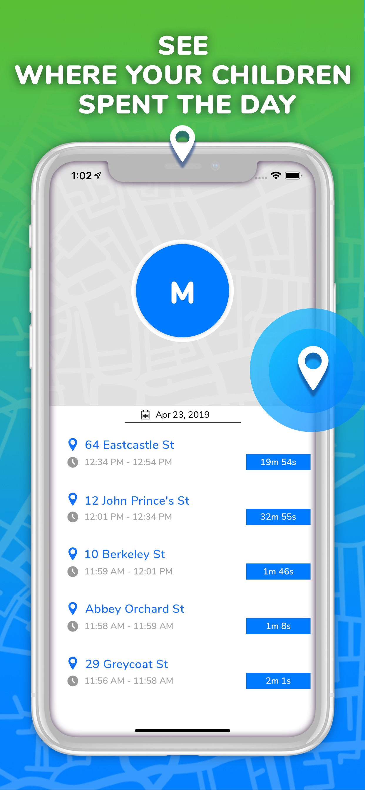

# iOS/React-Native Developer portfolio

&nbsp;&nbsp;&nbsp;&nbsp;&nbsp;&nbsp;&nbsp;&nbsp;&nbsp;

# E-Commerce App
This E-Commerce app was built in order to make a UI App for portfolio. Design can be reached here  https://www.figmafreebies.com/download/figma-mobile-brainstorming-ui-kit/.   
<b>For this project I used:</b>  
 *React Native 
 *Redux 
 *Typescript 
 *Figma 
 

  &nbsp;&nbsp;&nbsp;&nbsp;&nbsp;
  &nbsp;&nbsp;&nbsp;&nbsp;&nbsp;
  &nbsp;&nbsp;&nbsp;&nbsp;&nbsp;
  &nbsp;&nbsp;&nbsp;&nbsp;&nbsp;
  &nbsp;&nbsp;&nbsp;&nbsp;&nbsp;

 
 

# Addons Factory for Minecraft

Addons Factory is a simple toolbox for creating your own mods and addons for MCPE. It is very easy to use but in the same time it has a lot of features and content. Also this app contains social media features. It allows you to share your addons with others, allow you to follow other users,likes and write comments, download or edit existing addons with a copyright system. 
<b>For this project I used:</b>  
 *React Native 
 *Redux 
 *React Navigation 
 *Figma 
 *Lottie 
 *Figma 
 <b>In this project my part of work was:</b> 
 *UI Implementation 
 *Whole iOS and Android App 
 *In-App purchases 
 *Ad-Mob Advertising 
 *Preparing for publish to store 

  &nbsp;&nbsp;&nbsp;&nbsp;&nbsp;
  &nbsp;&nbsp;&nbsp;&nbsp;&nbsp;
  &nbsp;&nbsp;&nbsp;&nbsp;&nbsp;
  &nbsp;&nbsp;&nbsp;&nbsp;&nbsp;
  &nbsp;&nbsp;&nbsp;&nbsp;&nbsp;

 
 

# Crafty Skins for Minecraft

Crafty Skins for Minecraft ™ - is the best app to create or download a custom skin for Minecraft ™. 
This is not just a simple skin creator or a skin app. Here you can choose from thousands of all done parts of the skin a made your own mix. You can mix: the hat, hair style and color, mouth, nose, arms, legs, jackets, much more... We have 5 categories of all done skins: Boys, Girls, Animals, Superhero and Anime. 
<b>For this project I used:</b>  
 *React Native 
 *Redux 
 *React Navigation 
 *Figma 
 *Lottie 
 *Figma 
 <b>In this project my part of work was:</b> 
 *UI Implementation 
 *Whole iOS and Android App 
 *In-App purchases 
 *Ad-Mob Advertising 
 *Preparing for publish to store 

  &nbsp;&nbsp;&nbsp;&nbsp;&nbsp;
  &nbsp;&nbsp;&nbsp;&nbsp;&nbsp;
  &nbsp;&nbsp;&nbsp;&nbsp;&nbsp;

 
 

# Amigo: Family & Friends finder

“Amigo: Family & Friends finder” is the best location sharing and location finder application. More then this you can chat with your group and you don't need another app for all this. Contact the person you want to follow by their code that our app gives to every user. The only thing that both of you need is to have “Amigo: Family & Friends finder” installed on your devices. Just install the app and send to another user an invite to your group or join to theirs. When they accept your follow request you can follow their location. 

The app is perfect to know every time where are your kids, friends or any other people you care. 
<b>For this project I used:</b>  
 *Swift 
 *RxSwift 
 *CoreLocation 
 *NodeJS 
 *Socket.io 
 *Lottie 
 *Figma 
 <b>In this project my part of work was:</b> 
 *Full iOS App 
 *Full Backend 
 *Design implementation 
 *Ad-Mob Advertising 
 *In-App Purchases 
 *Preparing for publish to store 

  &nbsp;&nbsp;&nbsp;&nbsp;&nbsp;
  &nbsp;&nbsp;&nbsp;&nbsp;&nbsp;
  &nbsp;&nbsp;&nbsp;&nbsp;&nbsp;
  &nbsp;&nbsp;&nbsp;&nbsp;&nbsp;

 
 

# Smart BT Notifier

Enable your iOS device to send notifications to near BLE enabled smart watches. 

Smart BT Notifier let you connect to all near by BLE devices including smart watches and see their services.  

Smart BT Notifier have the greatest feature that will make your iPhone much more useful. Now you can keep your iPhone in your pocket while driving or having a walk. Your smart-watch will show who is calling you, who texted and more then this you can answer to this call if your watch have this function. Another great feature is that now you have your "Anti lose" technical protection. The connections works maximum on 10-30 meters it depend on Smart Watch type and if you are outside or inside.  

Smart BT Notifier has more great features: chat thru BT connection with your friends. You can create groups or just simple chats. Share any files thru bluetooth connection and find any bluetooth devices that are around you.
<b>For this project I used:</b>  
 *Swift 
 *RxSwift 
 *Core BT 
 *Lottie 
 *Figma 
 <b>In this project my part of work was:</b> 
 *Full iOS App 
 *Design implementation 
 *Ad-Mob Advertising 
 *In-App Purchases 
 *Preparing for publish to store 

  &nbsp;&nbsp;&nbsp;&nbsp;&nbsp;
  &nbsp;&nbsp;&nbsp;&nbsp;&nbsp;
  &nbsp;&nbsp;&nbsp;&nbsp;&nbsp;

 
 
